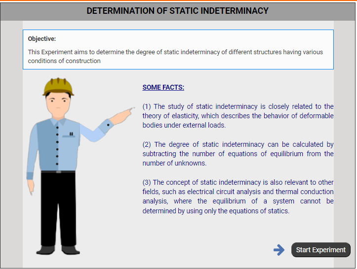
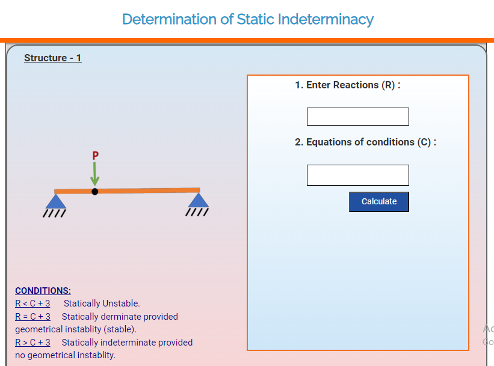

### These steps will be followed for the experiment

1. Click on start experiment button to start the experiment.

Step-1: (a) Click on 'Bring' button to display the different structure for analysis .

Step-1: (b) Click over the structure image to initiate the analysis.

Step-2: Input the required values and click calculate.

Step-3: After analysis of the structure click on 'hand' button to bring other structures for further analysis.

